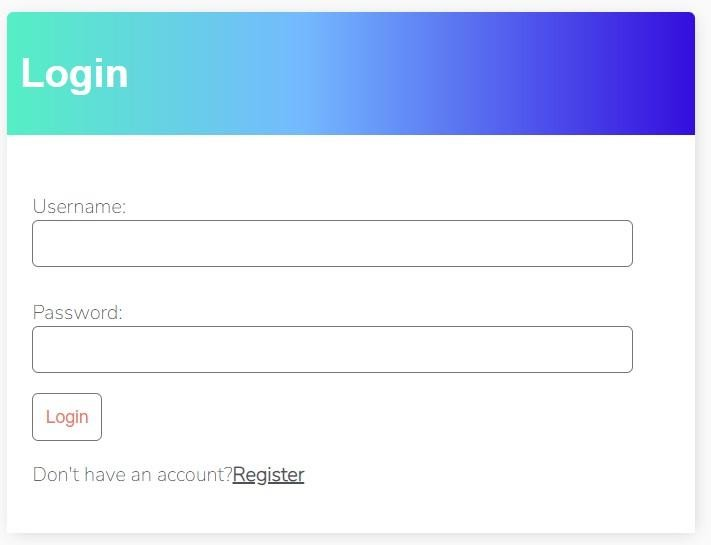
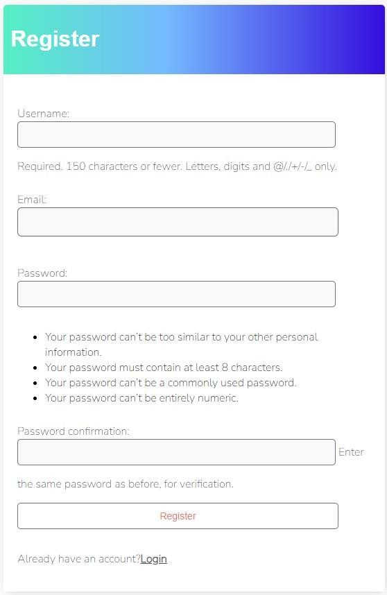
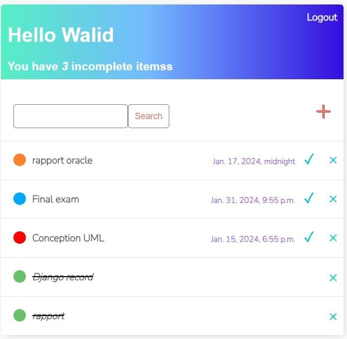
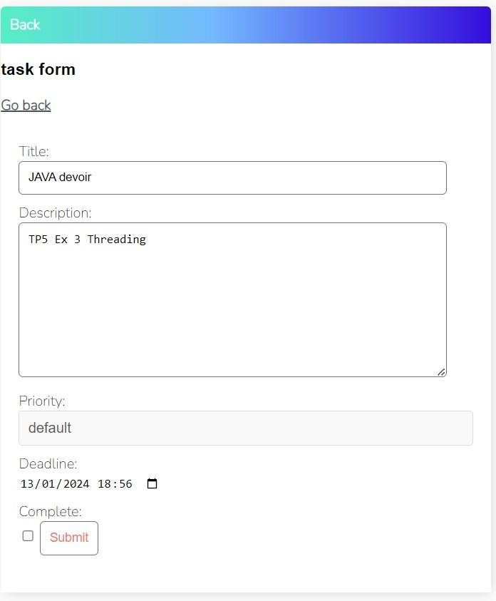
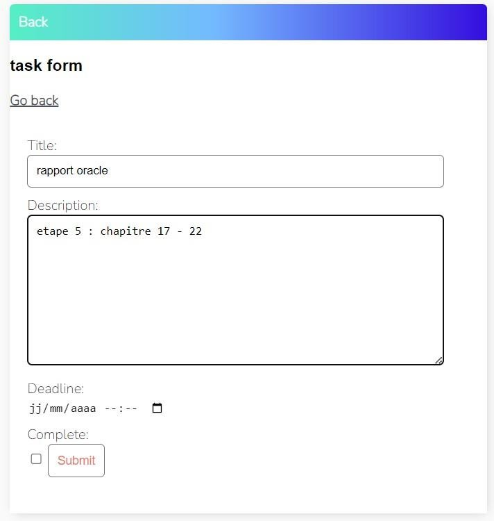
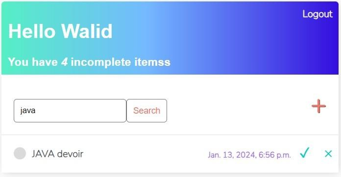
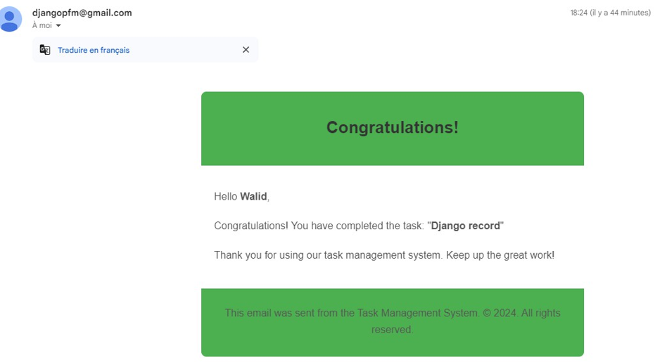

# **To-Do List App**  

This is a simple and efficient To-Do List app built using Django as the backend framework, HTML and CSS for the frontend, and SQLite as the database.

## **Features**
- **Add Tasks**: Easily add new tasks to your to-do list.
- **Edit Tasks**: Update task details, including marking them as completed.
- **Delete Tasks**: Remove completed or unnecessary tasks.
- **Task Filters**: View all tasks, completed tasks, or pending tasks.

---

## **Technologies Used**
- **Django**: Backend framework.
- **HTML & CSS**: For the frontend interface.
- **SQLite**: Database to store tasks.

---

## **Installation**

1. Clone the repository:
    ```bash
    git clone https://github.com/bouaziz08/FPM_django.git
    ```
2. Navigate to the project directory:
    ```bash
    cd todo_List
    ```
3. Install the required dependencies:
    ```bash
    pip install -r requirements.txt
    ```
4. Run the Django development server:
    ```bash
    python manage.py runserver
    ```
5. Open your browser and go to `http://127.0.0.1:8000` to use the app.

---

## **Usage**

1. **Home Page**: View all your tasks on the home page.
2. **Add Task**: Use the "Add Task" button to create new tasks.
3. **Edit Task**: Click on a task to edit or mark it as completed.
4. **Delete Task**: Use the "Delete" button to remove completed or unwanted tasks.

---

## **Screenshots**

**Login Interface**  


**Register Interface**  


**Dashboard**  


**Add Task Interface**  


**Modify Task Interface**  


**Filter Interface**  


**Email Interface**  

---

## **License**
This project is licensed under the MIT License - see the [LICENSE](./LICENSE) file for details.

---

## **Contact**

For questions or feedback, reach out via GitHub or email at [bouaziz.design08@gmail.com](mailto:your.email@example.com).
